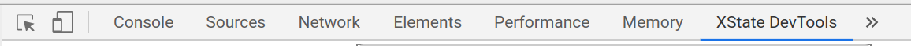

A browser extension for inspecting XState machines running in your app.

Powered by the awesome [XState-Viz project](https://github.com/statecharts/xstate-viz) by [David Khourshid](https://github.com/davidkpiano).

**Note**: The extension requires XState version v4.7.0 or newer:

# Usage

```sh
npm install xstate @^4.7
```

In every place where a service is started, pass the Interpreter option `devTools: true`:

```js
interpret(machine, { devTools: true }); // with `interpret` from xstate

useMachine(machine, { devTools: true }); // or with `useMachine` from @xstate/react
```

Now start the app and open the DevTools (Ctrl+Shift+I), in the XState DevTools extension panel:


# Demo

If you wanna play around with it as easily as possible, I would suggest:

1. Install the [XState DevTools](https://chrome.google.com/webstore/detail/xstate-devtools/aamnodipnlopbknpklfoabalmobheehc) Chrome extension
2. Open up this [Calculator CodeSandbox](https://codesandbox.io/s/green-feather-oxcw7) here which already uses `xstate@next`
3. Make sure to click **Open in New Window**
4. Open up the DevTools and pick the XState DevTools panel
5. Let me know how it goes! 👍

# Download

| Browser | Download                                                                                                                                                                                                                                                                          |
| ------- | --------------------------------------------------------------------------------------------------------------------------------------------------------------------------------------------------------------------------------------------------------------------------------- |
| Chrome  | <a href='https://chrome.google.com/webstore/detail/xstate-devtools/aamnodipnlopbknpklfoabalmobheehc'></a> |
| Firefox | Sometime soon™!                                                                                                                                                                                                                                                                   |

# Development

In the root and public directory (`xstate-devtools/` & `xstate-devtools/public`) run

```bash
npm i
```

In root run

```bash
npm link
```

In public run

```bash
npm link @statecharts/xstate-viz
```

In root run (and keep running in a terminal)

```bash
npm run develop
```

This command will compile the TS code for the XState-Viz component hierarchy (which is most of the React code for the extension's DevTools panel UI)

Open another terminal, and in public run:

```bash
npm run watch
```

This command will generate a development build of all the React code. The code at `public/src` depends on the compiled TS for execution, which we keep up to date using the previous command.

Open Chrome at the URL:

```
chrome://extensions
```

Click `Load unpacked` and select the following directory from this repo:

```
public/extension
```

The extension should now be available for use.

## Useful debugging tips

- The DevTools window for the background script can be opened from `chrome://extensions`
- It is possible to inspect the DevTools panel's page in a separate DevTools window: open the XState DevTools panel, and click Ctrl+Shift+I to inspect it.

**Note**: React development build is normally not written to disk, and an in-memory development server is used instead. While this works for web app development in normal web pages, this won't work when developing the app to run in a DevTools panel page, since web extension API requires serving up files directly from file system, rather than from a server. In order to avoid long waiting times in building the alternative optimized production build (with `npm run build`), it is suggested to use `npm run watch`, as this script makes use of a special tool called `cra-build-watch` to write a development build to disk. This build helps decrease the waiting time for builds and thus improves development workflow.

# Production

In root run:

```bash
npm run build
```

In public run:

```bash
npm run build
```
